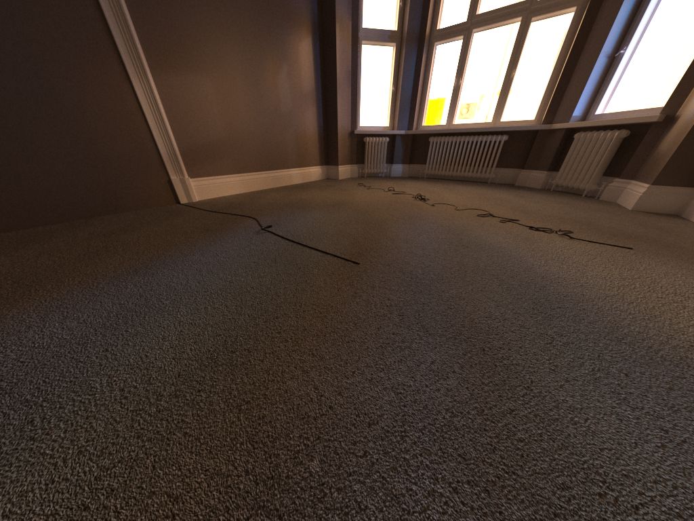

# DEPRECATED (merged to exr-info)
# cryptomatte-masks
Extract a mask of all objects in the scene from the cryptomatte.

EXR files generated by renders contain a cryptomatte that contains the anti-aliased mask of each
element in the scene. This script extracts each of those masks and exports a combined mask in PNG format,
where each object is given an ID and each pixel has a single object associated with it.




## Usage
Edit the parameters within `config.yaml` to configure the script. The parameters can also be
overwritten from the command line.

```bash
python extract_masks_from_cryptomattes.py dir_input=images/ dir_output=images/
```

For each EXR file in the input dir, it will generate:
 - A mask of all objects in the scene, in 16-bit, single-channel PNG format 
 - An RGB visualization of the mask.
 - A JSON file containing mapping from object names to IDs in mask. Example of output json:
    ```json
    {"cords": 0, "floor": 1, "vrayLightDome": 2, "walls": 3}
    ```

## Installation

```bash
pip install -r requirements.txt
```
